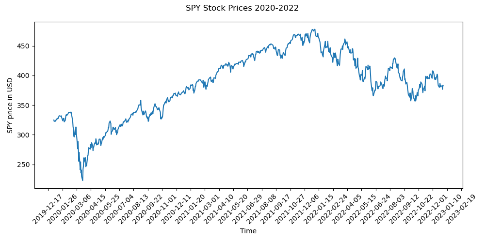
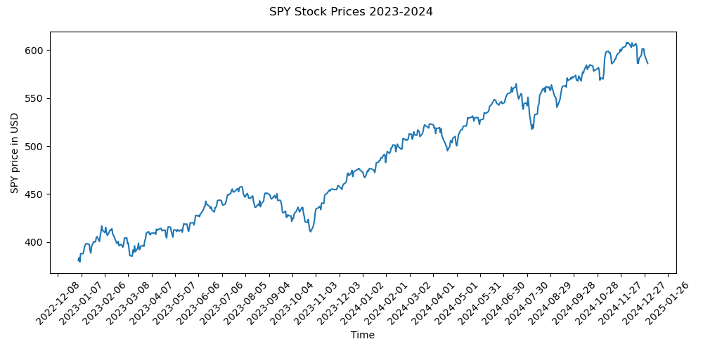
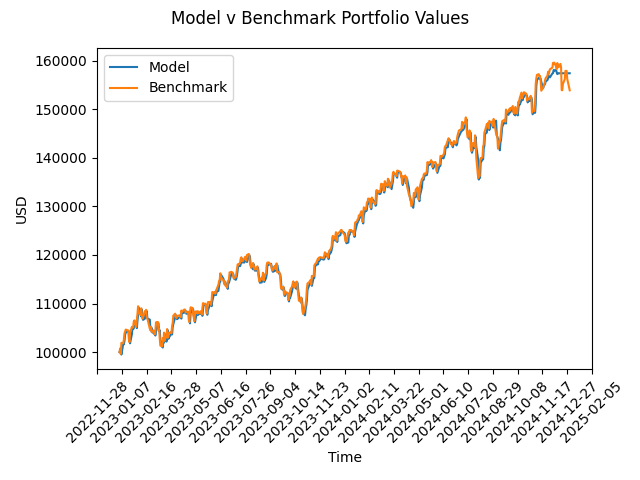

<br>

<div align="center">


</div>

# ReinFin
Reinforcement learning in finance.


## [0. Contents](#0._Contents) <a id='0._Contents'></a>

## [1. Introduction](#1._Introduction)

* ### [1.0 Reinforcemnet Learning](#1.0_Reinforcement_Learning)
* ### [1.1 Algorithmic Trading](#1.1_Algorithmic_Trading)

## [2. Code Base](#2._Code_Base)

* ### [2.0 `bin`](#2.0_bin)
  * #### [2.0.0 `conf`](#2.0.0_conf)
* ### [2.1 `data`](#2.1_data)
* ### [2.2 `images`](#2.2_images)
* ### [2.3 `logs`](#2.3_logs)
* ### [2.4 `model`](#2.4_model)
* ### [2.5 `reinfin`](#2.5_reinfin)
  * #### [2.5.0 `agents`](#2.5.0_agents)
  * #### [2.5.1 `environment`](#2.5.1_environment)
  * #### [2.5.2 `extract`](#2.5.2_extract)
  * #### [2.5.3 `processing`](#2.5.3_processing)
  * #### [2.5.4 Top-level utilities](#2.5.4_Top-level_utilities)

## [3. DDQN Discussion](#3._DDQN_discussion)

## [4. Results and Next Steps](#4._Results_and_Next_Steps)

## 1. Introduction<a id='1._Introduction'></a>
The purpose of this project is to explore Reinforcement Learning in the context of finance.
More specifically, RL is commonly applied to stock trading.

### 1.0 Reinforcement Learning <a id='1.0_Reinforcement_Learning'></a>
Reinforcement Learning (RL) is a branch of Machine Learning (ML) where an agent set in an environment both observes and acts.
In contrast with other branches of ML, the RL agent takes actions that change its environment (rather than simply observing to learn a pattern/signal).
The agent learns to make decisions by interacting with an environment. 
The goal is to learn a policy that maximizes cumulative reward over time. 
At each step, the agent observes the current state, chooses an action, receives a reward, and transitions to a new state. 
Through trial and error, the agent learns which actions yield the most favorable long-term outcomes.

Key concepts:
* **Agent:** The decision-maker.
* **Environment:** The scenario with which the agent interacts.
* **Reward:** Feedback signal for each action.
* **Policy:** The strategy that the agent follows to select actions.

Some common applications of RL include 
* gaming 
* robotics
* autonomous vehicles
* finance

There is a massive amount of literature on RL, and many algorithms have been proposed and proven effective.
Currently, in this project we will implement the Dueling Double Deep Q Learning algorithm.
This is an algorithm which builds off of the Double Deep Q Network which in turn is built off of so-called Deep Q Networks.
In [Section 2.](#2._Code_Base) we will discuss how we implemented this network.

### 1.1 Algorithmic Trading <a id='1.1_Algorithmic_Trading'></a>
Algorithmic trading is the use of computer programs to execute financial market trades based on predefined rules and strategies. 
These algorithms can analyze market data, identify trading opportunities, and place orders at speeds and frequencies far beyond human capabilities.
This blend of finance, data science, and software engineering is a prime area for applying machine learning and reinforcement learning to dynamically optimize decision-making.

In this project we use RL to develop a trading algorithm to make daily buy/sell/hold decisions for a single stock market symbol (SPY).
This is just one of many examples of a trading algorithm from the fast-paced domain of algorithmic trading.


#### 1.1.0 Technical indicators <a id='1.1.0._Technical_Indicators'></a>
Part of our trading strategy involved utilizing some financial technical indicators.

**Exponential Moving Average**

EMAs are commonly used in conjunction with other indicators to confirm significant market moves and to gauge their validity.

```math
\text{EMA}(t) = P(t)\cdot \frac{S}{1 + N} + \text{EMA}(t-1)\left(1 - \frac{S}{N+1}\right)
```

where $P(\cdot)$ is the price function, $S$ is a smoothing value (typically 2), and $N$ is the length of your window for the moving average.

**Relative Strength Index**

Relative Strength Index (RSI) is a momentum oscillator that measures the speed and change of price movements. 
RSI oscillates between zero and 100. 
Traditionally, and according to Wilder, RSI is considered overbought when above 70 and oversold when below 30. 
Signals can also be generated by looking for divergences, failure swings and centerline crossovers. RSI can also be used to identify the general trend.

```math
\text{RSI} = 100 - \left[\frac{100}{1 + \frac{\text{avg gain}}{\text{avg loss}}}\right]
```

**Moving Average Convergence Divergence**

The MACD line is calculated by subtracting the long-period EMA from the short-period EMA. The calculation creates the MACD line. A midlength-day EMA of the MACD line is called the signal line, plotted on top of the MACD line, which can function as a trigger for buy or sell signals.

```math
\text{MACD} = \text{EMA}_\text{long} - \text{EMA}_\text{short}
```
```math
\text{MACD}_\text{signal} &= \text{EMA}_\text{midlength}
```

**Bolinger Bands**

Bollinger Bands are a popular technical analysis tool used by stock market traders to assess price volatility and identify potential buy or sell signals.

```math
\text{Upper band} &= N\text{-day SMA} + N\text{-day SD}\cdot 2
```
```math
\text{Middle band} &= N\text{-day SMA}
```
```math
\text{Lower band} &= N\text{-day SMA} - N\text{-day SD}\cdot 2
```

**Stochastic Oscillator**

A stochastic oscillator is a momentum indicator comparing a particular closing price of a security to a range of its prices over a certain period of time. 
The sensitivity of the oscillator to market movements is reducible by adjusting that time period or by taking a moving average of the result. It is used to generate overbought and oversold trading signals, utilizing a 0–100 bounded range of values.

```math
\text{SO} = 100\cdot \left(\frac{C - L_N}{H_N - L_N}\right)
```

where $C$ is the most recent close price, $L_N$ is the low over the last $N$ days, and $H_N$ is the high over the last $N$ days.

**Volume Weighted Average Price**

The volume-weighted average price (VWAP) is a technical analysis indicator used on intraday charts that resets at the start of every new trading session. 
It's the average price a security has traded at throughout the day, based on both volume and price.

```math
\text{VWAP} = \frac{\text{Cumulative}(\text{Typical Price} \cdot \text{Volume})}{\text{Cumulative}(\text{Volume})}
```

where $\text{Typical Price} = \frac{H + L + C}{3}$.


## 2. Code Base <a id='2._Code_Base'></a>

### 2.0 `bin` <a id='2.0_bin'></a>

Each subdirectory in the `bin` directory contains the end-user Python scripts to be executed along with the `conf` subdirectory corresponding config files.
These subdirectories are
* `agents`: contains the end-user scripts for running the DDQN agent and the Price Predictor agent.
* `extract`: contains the end-user script for running the data extract.
* `processing`: contains the end-user script for obtaining the technical indicators as additional features for the data. 

#### 2.0.0 `conf` <a id='2.0.0_conf'></a>

The `conf` subdirectory contains the `.yml` config file to be passed via the `-c` flag to the appropriate `.py` end-user script.
Here is an example of how an end-user script is executed on the command line:

`python bin/agents/ddqn_runner.py -c bin/agents/conf/ddqn_test_config.yml`

### 2.1 `data` <a id='2.1_data'></a>

The `data` directory contains the stock data files. This is where the `extract` script delivers the extracted data,
and it is where the `processing` scripts deliver the processed data files.

### 2.2 `images` <a id='2.2_images'></a>

The `images` directory contains the image files generated from scripts like the `ddqn_runn.py` and `price_predictor.py` scripts. 

### 2.3 `logs` <a id='2.3_logs'></a>

The `logs` directory is where all script logs are delivered. 
Every time a script is executed, a logfile is generated and saved in an appropriate subdirectory of the `logs` directory.
To avoid collisions each logfile's file name is appended with a `pipeline_id` that is randomly generated (unless it is set using the script's config file).

### 2.4 `model` <a id='2.4_model'></a>

The model directory is where the trained `ddqn` models are saved (given the appropriate config option is properly set).

### 2.5 'reinfin' <a id='2.5_reinfin'></a>

The `reinfin` directory is a Python library housing all the scripts for the project.

#### 2.5.0 `agents` <a id='2.5.0_agents'></a>
Holds trading agent implementations:

* `ddqn_bot.py`: The main Dueling Double DQN agent logic.

* `ddqn_runner.py`: Script to train, evaluate, and visualize a DDQN agent.

* `price_predictor.py`: A supervised learning model for price prediction baseline. Utilizes Auto-ARIMA.

* `tradingbot.py`: This is a simplified trading bot that uses the `alpaca_trade_api` and `lumibot` packages. 
Serves as a secondary benchmark for DDQN agent performance.

Accompanied by separate config modules (`*_config.py`).

#### 2.5.1 `environment` <a id='2.5.1_environment'></a>
Contains a Gym-like custom trading environment to simulate market interactions for the RL agent.

#### 2.5.2 `extract` <a id='2.5.2_extract'></a>
Extracts historical stock price data from external sources and stores it in the `data` directory.
The extract also includes sentiment scores of relevant news headlines for the given stock symbol.

* `extractor.py`: Core extraction logic.

* `extractor_config.py`: Configuration for symbol, date range, etc.

#### 2.5.3 `processing` <a id='2.5.3_processing'></a>
Responsible for data transformation and feature engineering--mainly financial technical indicators.

* `tech_indicators.py`: Appends financial indicators as features.

* `tech_indicators_config.py`: Controls the indicators to compute and how.

#### 2.5.4 Top-level utilities <a id='2.5.4_Top-level_utilities'></a>

* `config.py` / `configamend.py`: Load and dynamically modify YAML configuration files.

* `constants.py`: Global constants like default paths, column names, etc.

* `finbert_utils.py`: Helper functions to integrate sentiment from FinBERT.

* `log_wu.py`: Logging utilities.

* `util.py`: Miscellaneous utilities shared across modules.

## 3. DDQN Discussion <a id='3._DDQN_discussion'></a>

Let $\mathcal{S}$ denote the state space of the game--all possible positions a player could find themselves in (e.g., various stock metrics leading up to trade time).
Let $\mathcal{A}$ denote the (discrete) action space. 
At step $t$, agent observes a reward of value $r_t$; throughout the game the agent is trying to maximize the discounted return 
$$R_t = \sum_{\tau =t}^\infty \gamma^{\tau-t}r_\tau,$$
where $\gamma \in [0,1]$ is a discount factor that quantifies the importance of immediate v. future rewards.

Given a stochastic policy (distribution of action choices given a state) $\pi$, the corresponding values of a given state-action pair $(s,a) \in \mathcal{S}\times \mathcal{A}$ are 

$$Q^\pi(s,a) = \mathbb{E}[R_t|s_t = s, a_t = a, \pi]$$

$$V^\pi(s) = \mathbb{E}_{a\sim \pi(s)}[Q^\pi(s,a)]$$

$$A^\pi(s,a) = Q^\pi(s,a) - V^\pi(s)$$

The $Q$ function quantifies the value of choosing the action $a$ in state $s$. 
The **value** function $V$ measures how good it is to be in state $s$. 
The **advantage** function $A$ reflects a relative (within a fixed state) measure of importance of each action--this is what we will use to choose which actions to take.

$Q(s,a)$ satisfies the following recursive formula: $`Q^\pi(s,a) = \mathbb{E}_{s'}[r + \gamma \mathbb{E}_{a'\sim \pi(s')}[Q^\pi(s',a')] | s,a,\pi]`$

Let $`Q^*(s,a):= \text{max}_\pi Q^\pi(s,a)`$ denote the optimal $Q$-function.  
This gives a deterministic optimal policy: $`a = \text{argmax}_{a'\in \mathcal{A}}Q^*(s,a')`$. The optimal state-value $`V^*`$ is then given by $`V^*(s) = \text{max}_a Q^*(s,a)`$. 
It follows that $Q^*$ satisfies the Bellman equation:
```math
Q^*(s,a) = \mathbb{E}_{s'}[r + \gamma\text{max}_{a'}Q^*(s',a')|s,a]
```

In general, obtaining such functions is computationally unavailable. So we use an approximating **Deep Q network** $Q(s,a;\theta)$ where $\theta$ denotes the network's parameters. 
In our use-case this is a fully-connected feed-forward network with several hidden layers.
For our network, we use the MSE loss function as follows:
```math
L_i(\theta_i) = \mathbb{E}_{s,a,r,s'}\left[\left(y_i^\text{DQN} - Q(s,a;\theta_i)\right)^2\right]
```
with

```math
y_i^\text{DQN} = r + \gamma\text{max}_{a'} Q(s',a';\theta^-)
```

where $\theta^-$ represents the parameters of a fixed, separate target network (an earlier iteration of the current network). 
For several cycles of forward and backward passes, this target network is used to form the target value, then it is updated.

Double Deep Q Networks were introduced to improve the performance of Deep Q Networks by changing the target value to

```math
y_i^\text{DDQN} = r + \gamma Q(s',\text{argmax}_{a'}Q(s',a';\theta_i);\theta^-).
```

The idea for Dueling Deep Q Networks is to build upon the architecture of Double Deep Q networks by splitting the $Q$ network into two separate network streams: one for the $V$ function and one for the $A$ function. 
So the network $Q(s,a;\theta,\alpha,\beta)$ would be assembled from $V(s; \theta, \beta)$ and $A(s,a;\theta,\alpha)$ as follows:

$$Q(s,a;\theta,\alpha,\beta) = V(s;\theta,\beta) + \left(A(s,a;\theta,\alpha) - \frac{1}{|\mathcal{A}|}\sum_{a'} A(s,a';\theta,\alpha)\right).$$

The network is trained by repeated runs of game-play following an $\epsilon$-greedy strategy.
Given $0 \leq \varepsilon \leq 1$, the trading agent takes a random action with probability $\varepsilon$ (Explore); 
otherwise it follows its strategy determined by the current state of the DDQN (Exploit).
With each episode, the value of $\varepsilon$ is decreased until it hits a minimum value.

During learning, the agent accumulates experience of the form $(s_t, a_t, r_t, s_{t+1})$. In training the network, rather than using the current experience, the mini-batches of past experiences are sampled uniformly. 
This application of experience replay increase data efficiency and reduces variance.

## 4. Results and Next Steps <a id='4._Results_and_Next_Steps'></a>

### 4.1. Results <a id='4.1._Results'></a>
The DDQN agent was trained with the SPY symbol on 2020-2022 prices. 

<div align="center">



</div>

The agent was then evaluated on 2023-2024 SPY prices.

<div align="center">



</div>

The action space for the agent had 9 actions: hold, purchase SPY stock using 25%, 50%, 75% or 100% of cash-at-risk, and sell 25%, 50%, 75%, or 100% of SPY stock.

The benchmark for the agent is the price growth from 2023 to 2024. 
From 2023 to 2024 the SPY price had a multiplier of 1.5390.

The DDQN agent achieved a multiplier of 1.5741:

<div align="center">



</div>

This is a first result and can be further tuned and improved.

### 4.2. Next Steps <a id='4.2._Next_Steps'></a>

* Consider alternative NN structures (CNN, LSTM, deeper $A$ and $V$ networks, etc.)
* Improved forecasting, refined technical indicators
* Refined action space; continuous action space
* Expand to manage a multi-symbol portfolio
* Apply DDQN to other games: Blackjack, simple combinatorial games


